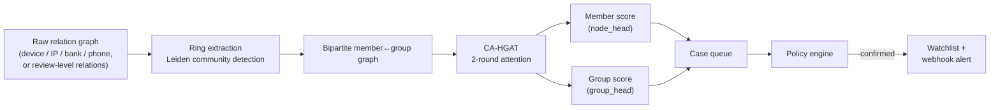
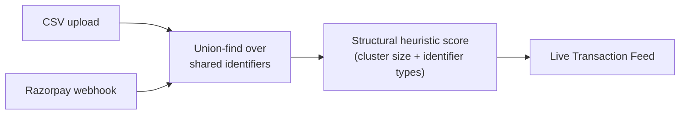
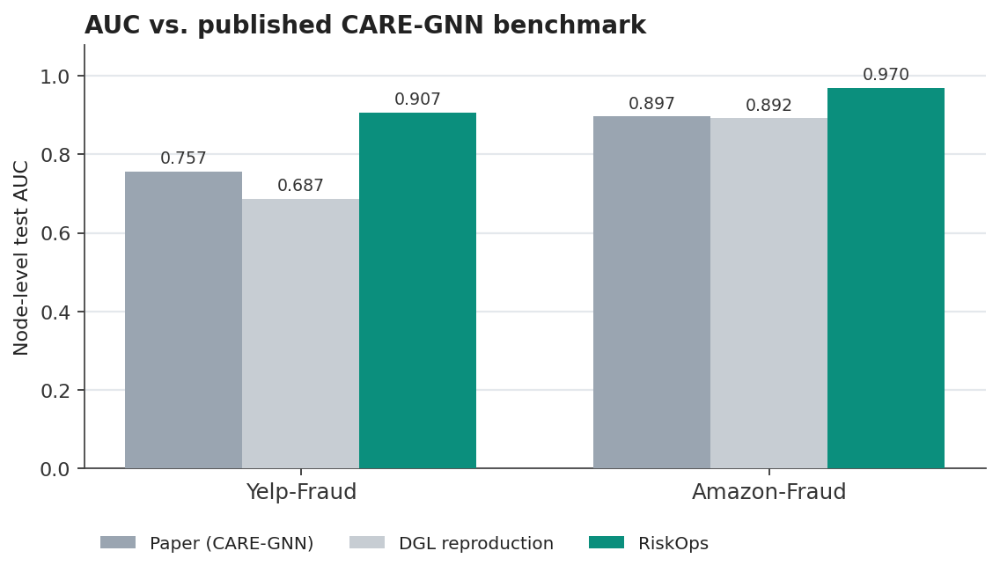
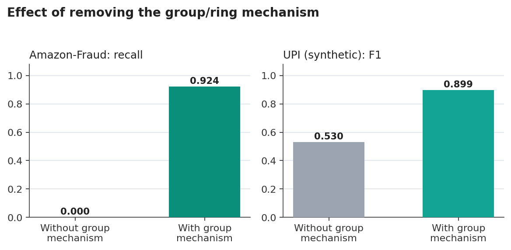
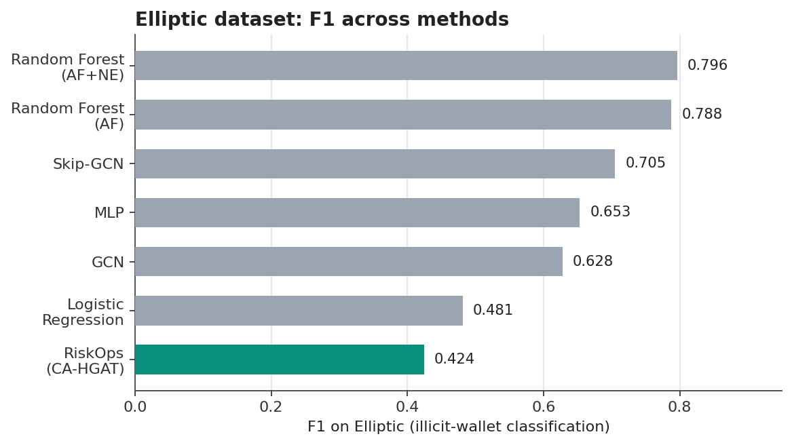
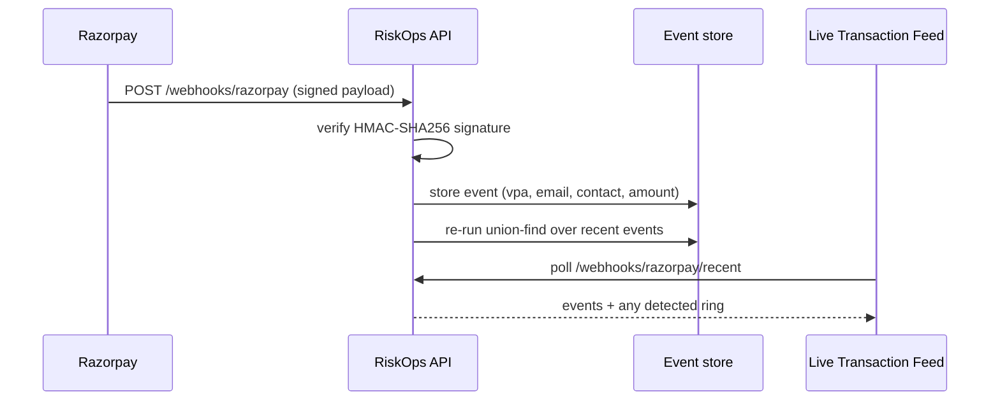

# RiskOps


**🔗 Live demo: [abuse-ring-10267.azurewebsites.net](https://abuse-ring-10267.azurewebsites.net)**

Graph-based detection of coordinated fraud rings. Built for Razorpay's AI
Risk Manager hackathon track.

---

## Contents

- [What this is](#what-this-is)
- [How it works](#how-it-works)
- [Results](#results)
- [Product](#product)
- [Razorpay integration](#razorpay-integration)
- [Running it](#running-it)
- [Repository layout](#repository-layout)

---

## What this is

Most fraud detectors score one account, one review, or one transaction at
a time. Coordinated rings are built specifically to survive that: each
individual account looks unremarkable, and the tell only shows up in what
they share — a device, an IP, a bank account, a phone number.

RiskOps scores the **group**, not just the individual. The core model,
**CA-HGAT** (Camouflage-Aware Hypergraph Attention Network), runs
attention over a bipartite graph of members and the groups they belong
to, so a group's risk score is learned jointly with each member's, not
computed by clustering after the fact.

## How it works



Two independent, lighter-weight paths reuse the same shared-identifier
idea without the trained model, so they run without a GPU or the ML
stack loaded:



## Results

Trained and evaluated on four datasets. Numbers below are read directly
from the committed metrics files in `backend/data/processed/`.

<table>
<tr><td width="50%">

**Beats the published CARE-GNN benchmark**



</td><td width="50%">

**Removing the group mechanism**



</td></tr>
</table>

On Elliptic (real Bitcoin transactions, real illicit-wallet labels), this
model is not the strongest method on the leaderboard:



| Dataset | Metric | Result |
|---|---|---|
| Yelp-Fraud | AUC | 0.907 (paper: 0.757, DGL reproduction: 0.687) |
| Amazon-Fraud | Recall, with vs. without the group mechanism | 0.924 vs. 0.0 |
| Elliptic | F1 | 0.424 |
| UPI (synthetic) | F1, with vs. without the group mechanism | 0.899 vs. 0.530 |

The Elliptic transaction graph is one continuous, highly connected
component rather than naturally separated clusters, which is a poor fit
for a method built around group structure — a plain Random Forest on
hand-engineered features (F1 0.788) is a better fit for that specific
graph shape. The comparison is included because it's part of the
evaluation, not because it favors the model.

## Product

A FastAPI backend and a plain HTML/CSS/JS frontend (no build step):

| Feature | Description |
|---|---|
| 🔎 Live Risk Check | Look up a VPA, device, or bank account against the exported ring index |
| 🕸️ Network Explorer | Interactive graph of the model's own member↔group structure |
| 📄 Upload & Trace | Drop in a CSV of logs; union-find splits it into connected rings live |
| 📡 Live Transaction Feed | Real-time view of incoming Razorpay-shaped payment events and detected rings |
| 🗂️ Case Queue | Filterable, bulk-actionable review queue with CSV export |
| ⭐ Watchlist | A confirmed ring's identifiers auto-flag any future case that reuses them |
| ⚖️ Policy engine | Auto-confirm / auto-clear / needs-review thresholds on score and group size |
| 🎚️ Auto-selected threshold | The operating point is swept against held-out predictions and cost-minimized, not hand-picked |
| 🔔 Webhook alerts | Ring confirmations POST to a configurable webhook (`ABUSE_RING_ALERT_WEBHOOK`) |

## Razorpay integration

`/webhooks/razorpay` verifies Razorpay's HMAC-SHA256 webhook signature and
applies the same identifier-matching logic used by the CSV upload tool to
incoming `payment.captured` / `payment.failed` events.



A companion endpoint (`/webhooks/razorpay/replay`) signs synthetic
traffic with the same secret and pushes it through the identical code
path, so the integration is testable without a live Razorpay account.

**To connect a real webhook:**

1. Set `RAZORPAY_WEBHOOK_SECRET` on the host running the app.
2. Razorpay Dashboard (test mode) → Account & Settings → Webhooks →
   Add New Webhook. URL: `<host>/webhooks/razorpay`, same secret,
   events `payment.captured` and `payment.failed`.
3. Trigger a test-mode payment (a Payment Link paid with a
   [test card](https://razorpay.com/docs/payments/payments/test-card-details/))
   to see a signed event arrive in the Live Transaction Feed.

## Running it

**API and frontend** (lightweight — no GPU or ML stack required; model
outputs are already committed in `backend/data/processed/`):

```bash
cd backend
pip install -r requirements.txt
uvicorn app.main:app --host 0.0.0.0 --port 8000
```

**Full training pipeline** (requires `torch`, `dgl`, and the packages in
`backend/requirements-ml.txt`):

```bash
cd backend
pip install -r requirements-ml.txt
python -m abuse_ring.train_eval --dataset all
python -m abuse_ring.export_cases --dataset all
python -m abuse_ring.export_analytics
```

## Repository layout

```
backend/
  abuse_ring/     model, training/evaluation, ring extraction, cost curves
  app/             FastAPI backend + static frontend, CSV pipeline, Razorpay webhook
  data/processed/  committed model outputs and sqlite case store
docs/images/       charts embedded above, generated from the committed metrics
```
